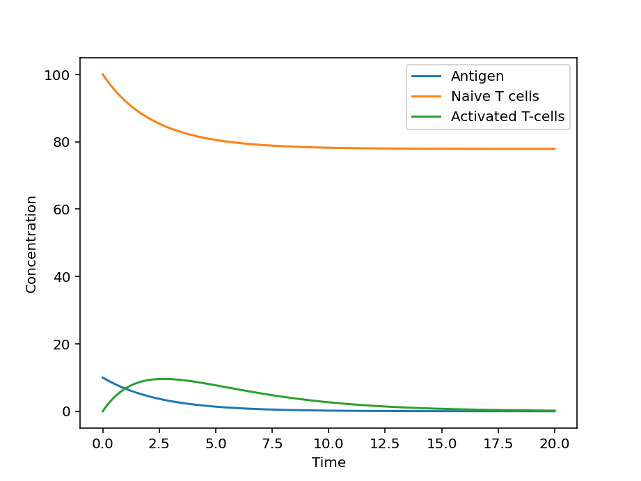

# 📌 Quantitative Modeling of Antigen-Driven T-Cell Activation Using Ordinary Differential Equations

A minimal mechanistic ODE model simulating antigen decay and T-cell activation dynamics to demonstrate quantitative reasoning in computational immunology.

---

## Rationale 🦠🧬

The adaptive immune response is initiated when antigen-presenting cells activate T lymphocytes. The magnitude and duration of T-cell expansion depend on antigen persistence and cellular turnover rates.

This project implements a simplified mechanistic model of antigen-driven T-cell activation using ordinary differential equations (ODEs). The goal is not to replicate full immunological complexity, but to demonstrate how biological processes can be translated into quantitative dynamical systems.

---

## 🧫 Biological Assumptions

The model is based on three assumptions:
- Antigen concentration decays over time.
- T-cell activation rate is proportional to antigen concentration.
- Activated T cells undergo natural decay.
- These assumptions capture the minimal dynamics required to describe a primary immune response.

---

## 🪀 Mathematical Formulation:

The system is described by:

   𝑑𝐴/𝑑𝑡 = −𝛿𝐴
   dN/dt = −αAN
   𝑑𝑇/𝑑𝑡 = 𝛼AN − 𝛽𝑇

Where:
- 𝐴(𝑡) = antigen concentration
- 𝑇(𝑡) = activated T-cell population
- 𝛼 = activation coefficient
- 𝛽 = T-cell decay rate
- 𝛿 = antigen decay rate

The system is solved numerically using SciPy's odeint.

---

## Simulation Overview

Initial conditions:
- High antigen concentration
- No pre-existing activated T cells

Simulations explore:
- Effect of antigen persistence
- Effect of activation strength
- Effect of T-cell decay rate

Time evolution of both populations is visualized.

---
## Key Observations and Conclusions:
## Simulation Output

### Observations:

- The graph shows that Antigen concentration decreases monotonically. The decline is steep in the early phase and it approaches near-zero by ~t = 12–15.
- In the same graph, Naïve T cells decline from ~100 to ~78. The decline slows and plateaus and they do not go to zero.
- It can be seen that Activated T cells rise rapidly early. Peak occurs around t ≈ 3–4 and after peak, they decline gradually, eventually approaching near-zero.
- The T-cell peak occurs after antigen begins declining. This happens because T-cell activation depends on prior antigen exposure, there is a biological lag between stimulation and population expansion and T cells continue expanding briefly even as antigen decreases. This delay is a hallmark of adaptive immunity.

### Interpretation:

- Regarding dynamics of Antigen concentration, the derease in concentration indicates Pathogen clearance, the decline in early phase shows Degradation and it approching near-zero presents Immune-mediated elimination. Additionally, the rapid early drop suggests a relatively high clearance rate (δ).
- Only slight decline in Naive T-cells means that there is only a fraction of naïve cells that are antigen-specific and activated. This is because once antigen is cleared, the activation stops.
- In the three classical immune phases observed in the graph, Expansion Phase shows High antigen which indicates that there is strong activation term (αAN dominates), Peak Response shows Antigen starts declining indicating that the activation weakens and Contraction Phase shows Antigen concentration that is nearly gone  whch indicates that the βT decay dominates.
- When stimulation < decay → contraction begins.
- This matches real adaptive immune responses like Clonal expansion, Effector peak and Contraction after clearance.
- The T-cell peak occurs after antigen begins declining. This happens because T-cell activation depends on prior antigen exposure. There is also a biological lag between stimulation and population expansion and the T cells continue expanding briefly even as antigen decreases. This delay is a hallmark of adaptive immunity.

*Conclusion:* The simulation demonstrates a classic antigen-driven adaptive immune response. Antigen levels decline exponentially, triggering transient activation and expansion of T cells. Activated T cells peak during early infection and subsequently contract as antigen availability diminishes. Naïve T cell depletion is partial and stabilizes once antigen is cleared. Overall, the model exhibits biologically consistent immune kinetics.

---

## Significance of this Project

This repository demonstrates:
- Translation of biological processes into differential equations
- Coupled dynamical system modeling
- Parameter interpretation in biological context
- Numerical simulation using Python

It reflects foundational quantitative reasoning relevant to computational immunology and systems biology research.

---

